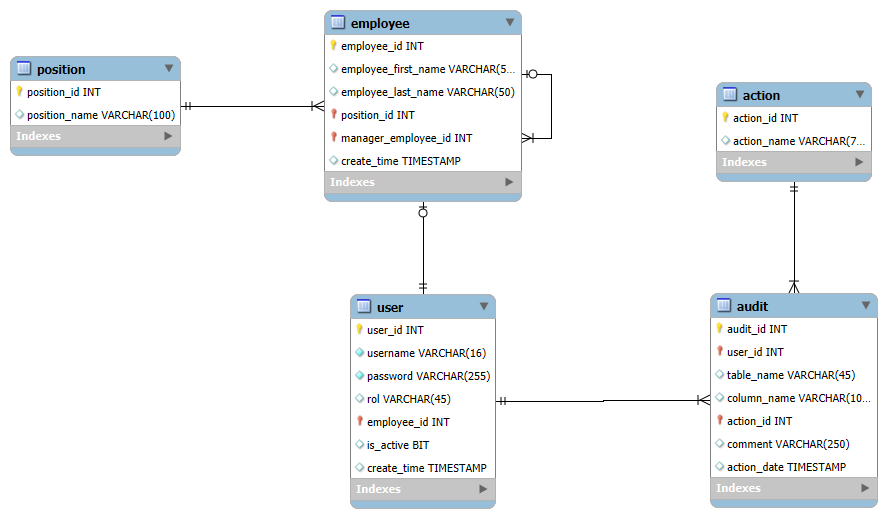

# Employee Hierarchy Management System

This project is a web application built with **ASP.NET Core MVC** that allows you to manage a hierarchical structure of employees. It includes:

- 🔐 Basic login system with password validation using BCrypt.
- 🌳 Dynamic employee hierarchy view.
- 🧭 Role-based tree display using Bootstrap 5.
- 🧩 Modular structure: API + MVC + Infrastructure + Application.
- 🗃️ Backend powered by SQL Server and stored procedures.

---

## 📂 Project Structure
EmployeeHierarchy/

├── EmployeeHierarchy.API # ASP.NET Core MVC frontend

├── EmployeeHierarchy.Application 

├── EmployeeHierarchy.Domain # Domain models and interfaces

├── EmployeeHierarchy.Infrastructure # Database access and Application services (Create, Read, Update, Delete)

├── EmployeeHierarchy.sln # Solution file

---

## 🚀 Getting Started

### 1. Clone the repository

```bash
git clone https://github.com/your-username/EmployeeHierarchy.git
cd EmployeeHierarchy
```

### 2. Install dependencies
Make sure you have installed:

.NET 8 SDK

SQL Server

Restore packages:

```bash
 dotnet restore
```

## ⚙️ Configuration
### 3. Update your database connection
   Edit EmployeeHierarchy.API/appsettings.json:

```bash
 "ConnectionStrings": {
  "DefaultConnection": "Server=localhost;Database=EmployeeHierarchyDB;Trusted_Connection=True;TrustServerCertificate=True;"
}
```

🔁 Replace localhost with your SQL Server name if different.

## 🛠 Database Setup
### 1. Run the script Script.sql located in:

```bash
EmployeeHierarchy.Infrastructure/Database/Script.sql
```

### 2. This script will:

* Create all necessary tables
* Insert default data (employees, users, positions)
* Create stored procedures

## 🔐 Login Access
Example credentials (from seed data):

+ Username: admin
+ Password: admin

Passwords are hashed with BCrypt in the database.

## 🖥️ Run the Application
```bash
dotnet run --project EmployeeHierarchy.API
```
Visit:

```bash
http://localhost:5091/Home/Login
or
http://localhost:5091/swagger/index.html
```

## 🗃 Database Diagram



## 🤝 Contributing
Pull requests are welcome. For major changes, open an issue first to discuss what you'd like to change.

## 📝 License
This project is licensed under the MIT License.

